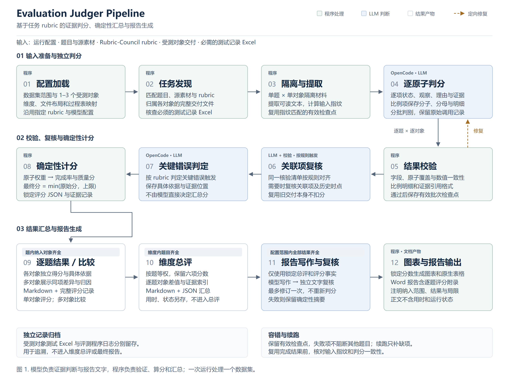

# Evaluation Judger

读取一个数据集中的题目、Rubric-Council `rubric.md`、源素材、受测对象交付和测试过程 Excel，借助 OpenCode 逐项判分，生成可追溯的逐题结果、维度总评和 Word 报告。一次运行处理一个数据集，支持 1–3 个受测对象。

## Pipeline

[](docs/assets/evaluation-judger-pipeline.svg)

图示对应当前开发版本。模型独立判断评分项并提供证据；程序校验、计分和汇总。逐题、维度和数据集分别检查结果齐全条件，过程记录独立归档。

[SVG 矢量图](docs/assets/evaluation-judger-pipeline.svg) · [PNG 高清图](docs/assets/evaluation-judger-pipeline.png)

## 安装

需要 Python 3.11+、[uv](https://docs.astral.sh/uv/) 和 OpenCode。当前中转站拒绝 OpenCode v2 自动发送的 `prompt_cache_key`；本项目默认使用隔离安装的 OpenCode 1.18.23，不改变系统中的 OpenCode。

```powershell
uv sync
npm.cmd install --prefix .evaluation-judger/opencode-v1 opencode-ai@1.18.23 --no-save
Copy-Item .env.example .env
```

在本地 `.env` 中填写 `AIAAA_API_KEY`。密钥、数据集、测试记录、运行日志、报告和技术方案均被 Git 忽略。也可直接通过环境变量提供密钥。

## 配置和运行

参考 [`config.example.json`](config.example.json) 配置数据集路径、受测对象名称与文件前缀、纳入的维度、Excel 列映射及模型。当前示例对应 DeepInsight 的第 1、2、4 维度。使用其他数据集时修改本地配置；`tasks` 可限定试跑题号，例如 `"tasks": ["4.1"]`。

如果只选多对象数据集中的一个对象，需在本地配置中填入其他对象的 `excluded_subject_prefixes`，例如 `["workbuddy5.5.6-"]`。目录名不同的数据集可通过 `layout.dimension_pattern`、`layout.task_pattern`、`layout.question_file` 和 `layout.rubric_file` 指定识别规则；两个正则都应包含命名捕获组 `id` 与 `name`。

```powershell
uv run evaluation-judger prepare --config config.example.json
uv run evaluation-judger run --config config.example.json
uv run evaluation-judger status --config config.example.json
uv run evaluation-judger report --config config.example.json
```

`run` 会处理本轮配置的全部题目。单个对象失败时会保存错误并继续其他对象和题目；再次运行会复用已完成结果、从有效的原子批次检查点续跑。只有配置范围内的结果全部齐全，才生成该范围的报告。`report` 仅使用已完成、输入指纹仍匹配的判分结果。一次运行的输出在配置的 `run_dir` 下：

- `workspaces/<题号>/<对象>/<输入指纹>/`：隔离的题目材料、OpenCode 原始事件和逐批检查点。
- `results/<题号>/<对象>.json`：每个原子的状态、理由、证据、比例明细、错误封顶判断和程序复算分数。
- `results/<题号>/compare-result.md` 或 `evaluation-result.md`：可读逐题结果。
- `results/dimension-*-summary.md` 和 `.json`：维度总评，包括每题各对象六项分数、质量均分和相对首列的差值。
- `process-records/dimension-*-subject-tests.json`：受测对象测试 Excel 的用时、状态及原始行号，独立保存，不进入总评或报告。
- `operation-records/judging-attempts.jsonl`：评测程序自身各次执行的 UTC 时间、耗时和完成状态，与受测对象运行记录区分。
- `reports/evaluation-report.docx`：本轮数据集报告。
- `reports/charts/`：从锁定分数生成的图表及同名数值 JSON。
- `failures.json`：本轮未完成的题目和对象，可据此定位后续续跑范围。

`report_mode` 支持 `auto`、`pilot`、`formal`。`auto` 对通过 `tasks` 明确限定且不足四题的试跑输出简短报告；完整配置范围默认生成正式报告，即使数据集本身题目较少。正式报告从锁定的维度总评生成章节、逐维度分析、对比表、质量图表和横向逐题六项评分附录；不包含用时、运行状态或成功率分析。调用 OpenCode 组织分析文字，并另做一次对照锁定事实的独立复核；图表和表格共用程序计算的数字。若文字生成或复核失败，使用标记为 `deterministic_fallback` 的确定性摘要完成报告，并在 `reports/narrative-error.json` 留下原因。若只纳入一个维度，报告结论仅适用于该范围。报告阶段不重新判分。

可通过 `report_scope_note` 补充本轮纳入或排除范围的说明。失分摘要优先展示未通过的具体核验项；没有逐项明细时保留完整判分理由，避免截掉位于后文的实际扣分依据。

## 评分口径

每题完成率为原子加权和，范围 0–100%；五项质量分分别为 `5 × 加权状态和 / 100`，范围 0–5。错误规则的上限由程序应用；单题质量均分是五项质量分的算术平均。维度和数据集对纳入题目等权平均，完成率不混入质量分。模型只提供逐项事实判定与证据，不直接决定汇总分数。

每个比例类原子必须保留分子、分母和逐项清单；每个原子必须有实际观察、判分理由及定位证据。JSON 保留完整记录；可读 Markdown 提供逐项差异速览，长清单展示全部未通过项、未知判定标签和少量通过示例，只省略可明确识别的正面条目。逐条解释兼容 reason/explanation/note/basis 字段；修正说明允许不同内容形式。Markdown 会转义交付物中的 HTML 标签，避免渲染器将其当作页面标签。验证失败只重做受影响的批次。历史交付按其执行或截止时点核验时效性，复用本身不扣分。

当 rubric 明确规定两个原子使用同一批主张时，程序检查其分母和明细数量；不一致时定向复核相关原子。若原始模型输出只是 JSON 标点损坏，先尝试语法修复，再做严格的原子覆盖、数值和证据字段校验。运行状态与报告只接纳通过跨原子和算分校验的结果。时间类原子优先使用过程表的执行时间；如表中仅有用时和状态，会记录交付文件保留的修改时间作为辅助线索，并明确其局限。

长主张核验（`CLAIM-RATIO`）单独调用，较短条目按 `batch_size` 分批。检查点按打分项编号恢复，调整分批策略后可复用旧批次的有效条目。无效日志不会永久占满重试次数；响应长度耗尽时转为逐项修复，超时输出也会保存。正式报告保存写作初稿，复核发现问题时自动定向修订一次并重新核查，再失败才降级为摘要。

目前文件提取支持文本、HTML、JSON、PDF、DOCX、PPTX 和 XLSX。图片、扫描版 PDF、交互网页等视觉内容需要进一步的专门检查；提取限制会写入材料清单，不能把无法读取当作受测对象缺失。数据集目录布局与对象前缀在配置中约定。运行前可用 `prepare` 核查任务与交付归属。

单次 OpenCode 调用默认最长 900 秒；可在本地 .env 设置 OPENCODE_REQUEST_TIMEOUT_SECONDS 调整。超时保留已捕获日志并进入恢复流程，未完成的评分不会补零。


## 其他数据集与只读材料核验

Excel 使用非数字题号时，可通过 `process_excel.task_id_map` 映射，例如 `{ "W1": "1.1", "O1": "2.1" }`；`last_row` 可限定实际记录末行。原 Excel 题号与行号独立归档，空白示例行不覆盖真实记录。默认仍接受原来的数字题号。

对于省略工作表行数元数据的 Excel，程序只读计算实际范围，不修改原表。题目按配置的 `dimensions` 顺序执行；未指定时按维度编号排序，不采用中文目录的字典序。

确认交付文件使用“对象标识-题号-原文件名”的收集规则时，可设置 `collection_prefixes_are_metadata: true`。清单记录去除本对象及当前题号归档标签后的逻辑文件名，用于 rubric 的文件名检查；实体文件、目录及证据路径保持原样。只移除已确认的前缀，不推断其他命名；任务号别名沿用 `task_id_map`。默认关闭，启用及映射配置进入输入指纹，避免混用不同命名口径的缓存。

`extraction_limit` 默认 `160000`；设为 `null` 可完整保留材料，模型通过分段读取核查长文件。提取策略变更会更新输入指纹，不复用采用不同提取策略的判断。

对于表格计算、公式和图表定义，可设置 `enable_material_inspector: true`。工具通过 OpenCode 内置本地 MCP 接入 Python 核验函数，无须额外插件 SDK。仅浏览器视觉核验需要安装 Playwright：

若当前模型接口支持图片，可设置 `enable_image_input: true`，让 OpenCode 直接读取本题本对象的 PNG/JPEG/WebP 原图及受控预览截图，核查图表类型、坐标轴、标签和可见内容。默认关闭，不改变已有配置的结果复用；启用会进入输入指纹。空的图片文本提取结果不能判为交付缺失。图片观察须与源数据锚点结合，不凭模糊像素猜测精确数值，也不执行交付的绘图代码。

无可摘录文字的视觉证据可使用 `kind: "visual"` 和具体的 `description`，同时保留原文件与视觉位置；可读 Markdown 明确标为“视觉观察”。该方式不豁免文本证据的引文要求，不接纳无位置或过于简略的观察。

```powershell
npm.cmd install --prefix .evaluation-judger/tool-runtime playwright@1.58.2 --no-save --ignore-scripts
```

工具只读取当前隔离目录清单列出的题目、rubric、源素材及当前对象交付，提供工作表数据、过滤、统计、分组、相关系数、公式、图表引用及分页 XML 查询，也支持 JSON 路径分页和长单行文本的字符范围读取。默认不启用，已有配置继续使用原流程。`pptx_visual` 在 Windows 上通过已安装的 PowerPoint 只读导出 PDF，并取得实际文字位置、越界与重叠候选；`browser` 使用已安装的 Chrome（或 Edge），在独立浏览器上下文中渲染当前对象的本地 HTML 和清单资产，进行有限的点击、填入、选择，并保存截图与 DOM 测量记录。它允许网页自身 JavaScript，但不运行交付的 shell、Python 或原生程序，禁止外部请求与下载，不访问个人浏览器配置。渲染记录放在本题隔离目录的 `inspection-evidence`。几何候选不能直接当作确认的版式缺陷；图片内容等仍有文本模型无法充分判断的限制。图表 XML 核验本身也不能替代最终视觉渲染。

规则导入会保留 Markdown 转义竖线。明确的封顶计数公式与普通成功比例分别计算；只有错误条款明确限制到部分原子时才应用局部零封顶，保留其他交付物得分。评测内置读取权限按实际 Git worktree 限定到本题本对象目录，禁止通过跨目录搜索读取其他对象。

报告写作和独立复核读取各自目录中的格式化锁定事实文件；超过 15 题的差值图自动分页分图，完整数值账本保留。`subject_models` 可按对象 ID 登记受测模型，在范围说明中呈现，不影响评分或结果复用。

启动探针必须完成真实读取并返回准确随机标记，失败会重试一次。若仍是无事件的启动超时且未开始评分，程序可自动使用一次新隔离目录，保留同一输入指纹与失败日志；已有原子检查点不搬迁。恢复后的目录路由持久化，再次运行能够接续，输入变化不会复用旧路由。

可选 `startup_deferred_retry: true` 会在本轮其他题目结束后，对尚无原子检查点的启动超时串行补试一次；默认关闭。补试仍复用有效结果，失败保留日志，不补零、不无限重试。请求超时的标准错误输出会脱敏保存为同名 `.stderr.txt`，与评分结果分开归档。

遇到网关限流导致长时间无事件，可在本地 `.env` 设置 `OPENCODE_FIRST_EVENT_TIMEOUT_SECONDS=180`。它只限制首条输出之前的等待；开始返回事件后仍使用完整请求时限。默认 `0` 关闭，保留原适配方式。上游限流时还应降低 `task_workers`，不要通过增加并发加重重试。

启用首事件守卫时，事件在请求进行中逐行脱敏保存，不必等到退出或超时才落盘。异常中断后可从已保存事件找回本题本对象的会话；仍需验证完整判分记录，工具读取或中间状态不会直接变成分数。

`task_workers` 默认 `1`；需要缩短大量题目的等待时可设为 `2`（最多 `4`）。并发仅发生在同一维度的不同题目，同题对象独立依次判分；每题目录、会话、检查点各自隔离，维度和最终报告由主流程检查齐全后生成。有效结果复用不受并发数量影响。只读 v1 配置关闭文件快照，避免无须编辑回滚时的额外跟踪；启动探针和恢复日志仍保留。

`critical_error_review: true` 为已触发的重大错误封顶增加独立证据复核，核对反证是否针对相同命题与时点。可撤销缺乏有效反证的封顶，并定向修正依赖同一无效反证的负面评分项；不引入额外扣分，保留锁定的事实样本和原判定历史。原子修正及封顶均由评测代码校验、计算和保存。旧配置默认关闭；启用后续跑会复用有效检查点，只为未完成这项复核的触发记录补齐复核，旧数据集不被自动重跑。

封顶复核日志按实际输入指纹保存；中断后先校验已有输出，再恢复同一任务对象的复核会话，输入变更时不复用旧会话。`critical_review_timeout_seconds` 可单独延长这类复杂核验的时限，默认 `900`；不改变评分批次或启动探针时限。

可选 `critical_review_scoped_input: true` 只向复核默认传入受影响的负面条目、其关联样本和触发条款引用的记录。完整原判定保存为 `critical-review-full-input.json`，复核需要时仍可读取；修正范围、证据和算数校验不变。默认关闭，原配置保持原复核输入方式。

评分记录回收兼容 `atoms` 数组、`atom` 单项包装、直接单项对象及直接数组；只规范容器形式，每项仍需通过题号、评分项、证据和算数校验。报告及封顶复核继续要求其各自的对象结构。只有工具读取事件而没有判分记录的超时日志不能作为评分结果。

报告正文中的分数优先保留两位小数；程序也接受锁定数值的等价写法及按 `ROUND_HALF_UP` 舍入至 1–6 位小数的表达，仍拒绝不在锁定事实及其合法舍入中的数字。独立正文复核继续检查数值与对象、题目和结论的对应关系。仅重跑 `report` 时保留旧写作和复核事件；恢复成功后旧错误归档至 `reports/attempt-history/`，不再作为当前错误展示。

报告写作、复核或修订遇到首事件静默超时时，各自最多自动重试一次；已取得响应的长请求和其他错误不因此无限重试。已有合法正文初稿会保存，后续 `report` 接续未完成的复核，无须重写初稿或重评题目。

没有失分记录的维度不生成空的失分依据标题；结论末段保持在同一页。重新执行 `report` 只更新报告呈现，复用有效正文与独立复核，不改变已锁定评分。
